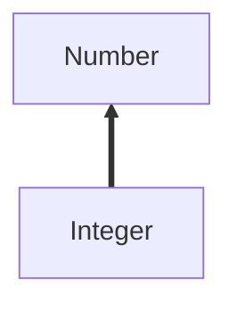
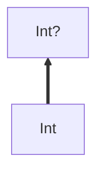
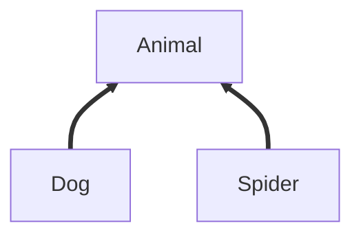
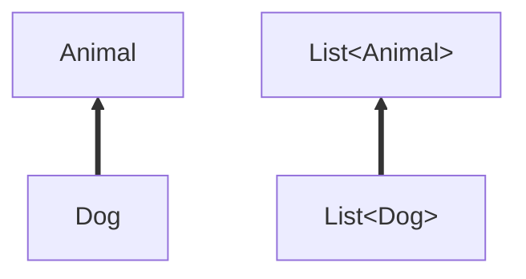
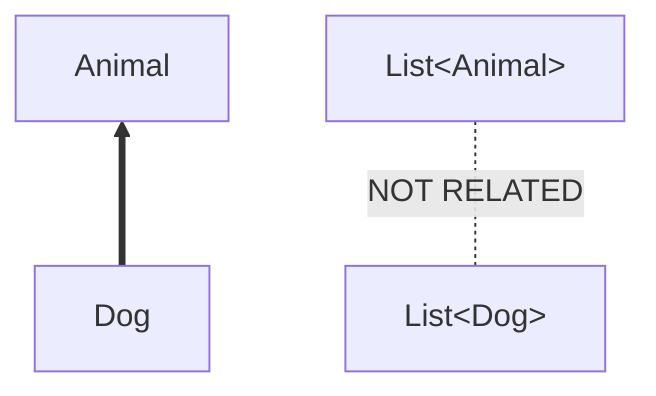
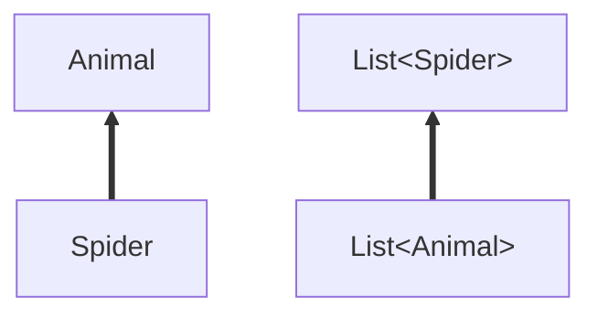

# 理解Kotlin中的泛型与变体

[原文](https://proandroiddev.com/understanding-generics-and-variance-in-kotlin-714c14564c47) by [Tomek Polański](https://proandroiddev.com/@tpolansk?source=user_popover)

在面向对象编程语言中，一个重要的卖点就是*继承*。

它允许我们进行诸如将一个子类的实例赋值到一个超类变量上：

```java
Integer integer = new Integer(1);
Number number = interger;
```

多亏了这个特性，我们可以更加抽象地编写代码，比如声明一个方法：

```java
void printNumber(Number number)
```

而这个方法可以接受两种类型：

```java
printNumber(integer);
printNumber(number);
```

不幸的是，在Java中的泛型不总是简洁明了的：

```java
List<Integer> integerList = new ArrayList<>();
List<Number> numberList = integerList; // Compiler Error
```

------

要真正理解泛型，首先我们需要理解这三个主要概念：

- **类** 与 **类型**
- **子类** 与 **子类型**
- 变体：**协变**、**逆变**与**不变**

## 类与类型

你或许从来没有想过类与类型是两种不同的概念。

在Java和Kotlin中，所有类都有至少一个与它自身相同的类型，比如一个`Integer`就同时是一个类也是一个类型。

从另一个方面来说，在Kotlin中我们也有可空类型，比如`String?`；我们不能说`String?`是一个类，因为从表面来看，它依旧是一个`String`字符串。

Java和Kotlin中还能举出另一个例子。`List`是一个类，但`List<String>`就不是一个类，而是一个类型。

我们用下面的表格对上面的两个例子进行一下总结：

|                | 类      | 类型   |
| -------------- | ------ | ---- |
| `String`       | 是      | 是    |
| `String?`      | **不是** | 是    |
| `List`         | 是      | 是    |
| `List<String>` | **不是** | 是    |


## 子类与子类型

一个子类需要继承自另一个类。比如，`Integer`继承自`Number`，所以`Integer`是`Number`的子类。



这也意味着我们可以进行下面的赋值：

Java:

```java
Integer integer = new Integer(1);
Number number = integer;
```

Kotlin:

```kotlin
val integer: Int = 1
val number: Number = integer
```

这些操作之所以能够实现是因为`Integer`是`Number`的**子类型**。

现在我们换成可空类型来试一下：

```kotlin
val integer: Int = 1
val nummableInteger: Int? = integer;
```

在这里`Int`是可空类型`Int?`的**子类型**，所以我们可以把`Int`赋值给`Int?`。



## 变体

首先让我们来定义几个Kotlin类：

```kotlin
abstract class Animal(val size: Int)
class Dog(val cuteness: Int): Animal(100)
class Spider(val terrorFactor: Int): Animal(1)
```



现在让我们来检查一下`Dog`和`Spider`是不是`Animal`的**子类型**：

```kotlin
val dog: Dog = Dog(10)
val spider: Spider = Spider(9000)
val animal: Animal = dog
animal = spider
```

完美运行：没有编译错误。自己试一下吧！

## 协变

让我们来把这些类型用泛型的`List`包装一下制造一些更复杂的类型：

一个需要记住的地方在于这个`List`是Kotlin中的不可变列表：一旦创建之后其中的内容就不可以被修改。很快你就会明白为什么这很重要了。

```kotlin
val dogList: List<Dog> = listOf(Dog(10), Dog(20))
val animalList: List<Animal> = dogList
```

变体告诉我们`List<Dog>`和`List<Animal>`之间的关系和`Dog`与`Animal`间的关系一样是**子类型**关系。

在Kotlin中，`dogList`可以被赋值给`Animal`类型的`List` (`val animalList: List<Animal> = dogList`)，所以类型关系被**保留**了，并且`List<Dog>`是`List<Animal>`的**子类型**。这就是**协变**。



## 不变

在Java中，即使`Dog`是`Animal`的子类型，你也不能这样做：

```java
List<Dog> dogList= new ArrayList<>();
List<Animal> animalList = dogList; // Compiler error
```

这是因为Java中的泛型类会忽略它的构件之间的**类型／子类型**关系。在这个例子中，`List<Dog>`不能被赋值给`List<Animal>`，反之亦然， 而这就被称为**不变**。这里就没有了**子类型**或是**超类型**的关系。



## 逆变

或许我们想要比较`Animal`实例，这也就是为什么我们创造了一个接口`interface Compare<T>`，和一个元方法`compare(T item1, T item2)`，这个方法可以判断两个对象的先后次序。

无论何时我们要通过可爱度来比较🐶的时候，我们可以这样实现这个接口：

```kotlin
val dogCompare:Compare<Dog> = object: Compare<Dog> {
  override fun compare(first: Dog, second: Dog): Int {
    return first.cuteness - second.cuteness
  }
}
```

但是如果你尝试将这个狗狗比较器赋值給一个动物比较器的话：

```kotlin
val animalCompare: Compare<Animal> = dogCompare // Compiler Error
```

这段代码出错的一个好处是：如果可以这样赋值的话，那么我们也可以用这个比较器来比较蜘蛛的可怕度， 但是这样就会出错，因为狗狗比较器只能用来比较狗狗而不是蜘蛛。

换个角度来说，如果我们要比较所有动物的话，那么需要一个能够同时衡量狗狗和蜘蛛的机制：

```kotlin
val animalCompare: Compare<Animal> = object: Compare<Animal> {
  override fun compare(first: Animal, second: Animal): Int {
    return first.size — second.size
  }
}
val spiderCompare: Compare<Spider> = animalCompare // Works nicely!
```

我们可以看到`Spider`是`Animal`的**子类型**，但是`Compare<Animal>`却成为了`Compare<Spider>`的**子类型**——在这里，类型关系发生了**反转**。这一种关系也被称为**逆变**。



## Java与Kotlin

多亏了Java，我们可以声明泛型的协变与逆变。

## Java

要声明一个**协变**的泛型类型，你只需要：

```java
List<Dog> dogs = new ArrayList<>();
List<? extends Animal> animals = dogs;
```

`extends`关键字将动物列表与狗狗列表之间的关系声明为了**协变**。

需要**逆变**的时候，只需：

```java
Compare<Animal> animalCompare = (first, second) -> first.getSize() - second.getSize();
Compare<? super Spider> spiderCompare = animalCompare;
```

`super`关键字将动物比较器与蜘蛛比较器之间的关系声明为了**逆变**。

这种在使用时创建泛型变体的用法叫做**调用处变体**。

## Kotlin

在Kotlin中并没有什么魔法，它也提供了为泛型声明**协变**与**逆变**的途径。

### Out关键字

如果你浏览过Kotlin的不变列表的定义，你会发现：

```kotlin
interface List<out E> {
  fun get(index: Int): E
}
```

这个`out`关键字表示这个`List`接口中的方法只能返回类型`E`并且不能接受`E`类型作为泛型参数。

这个限制使得`List`获得了**协变**能力。


### In关键字

当你查看Kotlin中`Compare`接口的定义，你会有不一样的发现：

```kotlin
interface Compare<in T> {
  fun compare(first: T, second: T): Int
}
```

在这里，泛型参数前面多了一个`in`关键字。

这意味着`Compare`接口下所有的方法都可以使用`T`作为泛型参数但是不能返回T类型。

这个限制使得`Compare`获得了**逆变**能力。


在Kotlin中，泛型变体的问题是编写类声明的开发者需要考虑的问题，而不应该丢给使用这些代码的程序员。这也就是为什么这个机制被称为**声明处变体**的原因。

------

|        | 协变            | 逆变      | 不变          |
| ------ | ------------- | ------- | ----------- |
| 目的     | 生产者           | 消费者     | 生产者+消费者     |
| 例子     | ImmutableList | Compare | MutableList |
| Java   | extends       | super   |             |
| Kotlin | out           | in      |             |

------

现在你应该已经知道了你需要声明什么样的泛型类了。